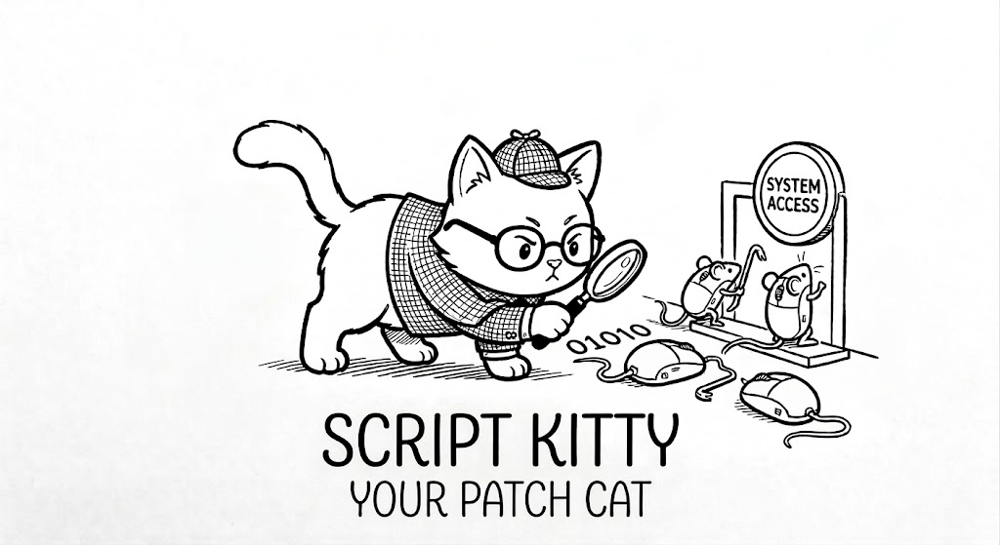
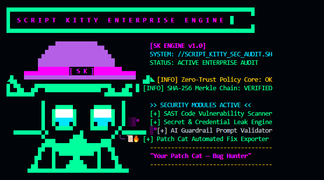

<p align="center">
  
</p>

<h1 align="center">Script Kitty 🐱🛡️</h1>

<p align="center">
  <strong>Your Patch Cat — Self-Hosted Enterprise Security Validation & AI Remediation Platform</strong>
</p>

<p align="center">
  <a href="https://github.com/andrecodexvictor/Script-kitty/blob/main/LICENSE"></a>
  <a href="https://github.com/andrecodexvictor/Script-kitty"></a>
  <a href="https://github.com/andrecodexvictor/dotstack"></a>
  <a href="https://github.com/andrecodexvictor/dotarchiteture"></a>
  <a href="https://github.com/vinilana/dotcontext"></a>
  <a href="https://modelcontextprotocol.io"></a>
</p>

---

## 💻 CLI Terminal Preview

<p align="center">
  
</p>

---

## 📖 Overview

**Script Kitty** is an open-source, self-hosted enterprise platform for authorized security validation, multi-language static application security testing (SAST), secret leak detection, HTTP security header evaluation, server log auditing, Web2/Web3 smart contract verification, and AI LLM guardrail testing.

Combining a cyber detective cat identity (**Patch Cat**) with a rigorous operational governance model, Script Kitty provides automated vulnerability discovery, zero-trust policy enforcement, tamper-evident SHA-256 audit logging, and actionable remediation playbooks.

---

## ✨ Key Features & Capabilities

- **🚀 One-Word Global CLI (`sk` / `script-kitty`)**: Run `sk` without subcommands to launch the interactive arrow-key TUI menu.
- **🎮 Interactive Checkbox Suite Selector**: Use arrow keys (`⬆️/⬇️`) and Spacebar to select exactly which security modules to run.
- **💬 Direct Agent Conversation (`sk chat`)**: Direct natural language chat with the Detective Patch Cat agent (requires authenticated AI key/login).
- **🔑 Multi-Provider AI Key Manager & Codex Login**: Native support for OpenAI (GPT-4o), Google Gemini (2.5 Flash/Pro), NVIDIA NIM, OpenRouter, Anthropic Claude, xAI Grok, and ChatGPT Codex Subscription Tokens.
- **🤖 AI LLM Guardrail & Anti-Hallucination Engine**: 5 defensive verification suites covering System Prompt Extraction, DAN Jailbreaks, Unsafe Tool Calls, Indirect RAG Poisoning, and Anti-Hallucination Grounding.
- **⛓️ Web2 & Web3 Security Harnesses**:
  - **Web2 Harness**: Polyglot SAST (PHP, Ruby, Python, JS/TS), secret leaks, HTTP headers, Nginx/Apache log audit.
  - **Web3 Harness**: Solidity (`.sol`) smart contract auditing for reentrancy, `tx.origin` risks, unhandled calls, and weak randomness.
- **🔑 Secret & Credential Leak Engine**: Detects exposed AWS Access Keys, GitHub PATs, Slack tokens, SSH private keys, and JWT secrets.
- **🌐 HTTP Security Header Evaluator**: Checks HSTS (`Strict-Transport-Security`), CSP, X-Frame-Options, and CORS configuration.
- **🐾 Patch Cat Remediation Playbooks**: Produces step-by-step fix guides, hardening configurations, and copy-pasteable GitHub/GitLab Issues and Pull Requests.
- **⛓️ Tamper-Evident Hash-Chained Audit Engine**: SHA-256 cryptographic logging in Rust with Merkle Root export.
- **🛡️ Zero-Trust Policy Core & Approval Gates**: Enforces target allowlists (`scope.md`) and requires human approval for state-changing actions.
- **🌐 Internationalization (i18n)**: Native support for English (`en` default), Portuguese (`pt`), and Spanish (`es`).

---

## 🏗️ Multi-Language Hybrid Stack

Script Kitty's architecture is declared and governed by `.dotstack`, `.dotarchitecture`, and `.dotcontext`:

```text
                               ┌──────────────────────────────────────────┐
                               │           Script Kitty Dashboard         │
                               │          TypeScript / Vite / CSS         │
                               └────────────────────┬─────────────────────┘
                                                    │
                               ┌────────────────────▼─────────────────────┐
                               │     Orchestrator, CLI & MCP Server       │
                               │               TypeScript                 │
                               └──────────┬────────────────────┬──────────┘
                                          │                    │
                ┌─────────────────────────▼──┐             ┌───▼──────────────────────────┐
                │    Agent PREVC Runtime     │             │    Zero-Trust Policy Core    │
                │ Python (Scanners/Validators)│             │     Rust (Hash Audit Log)    │
                └────────────────────────────┘             └──────────────────────────────┘
```

| Component | Technology | Responsibilities |
+|---|---|---|
+| **Frontend & UI** | TypeScript, Vite, Vanilla CSS | Sleek cyberpunk defensive dashboard, 3D Motion Mascot, i18n selector |
+| **CLI & MCP Server** | TypeScript, Commander, MCP SDK | Operator command shell (`sk`) and stdio MCP server |
+| **Agent Runtime & Tools** | Python 3.11+, Pydantic | Web2/Web3 harnesses, polyglot SAST, log auditor, guardrail validator |
+| **High-Trust Core** | Rust 2021 | Zero-Trust Policy Engine, cryptographic SHA-256 Merkle audit logger |

---

## 🐾 Operating Modes

| Mode | Purpose | Risk Level | Approval Required |
|---|---|---|---|
| **Scout** | Passive exposure discovery, asset fingerprinting, header checks | Low Risk | No |
| **Verify** | Controlled confirmation of likely findings | Medium Risk | **Yes (Human-in-the-Loop)** |
| **Patch** | Produce actionable remediation playbooks & PR diffs | Low Risk | No |
| **Recheck** | Run regression checks to confirm fix closure | Low Risk | No |
| **Lab** | Aggressive educational testing inside isolated containers/VMs | High Risk | **Yes (Lab Mode Only)** |

---

## 🚀 Quick Start

### Prerequisites
- **Node.js** >= 18.0
- **Python** >= 3.11
- **Rust (Cargo)** >= 1.75 *(Optional for local Rust crate compilation)*

### Installation & Global Link

```bash
# Clone the repository
git clone https://github.com/andrecodexvictor/Script-kitty.git
cd Script-kitty

# Install monorepo dependencies
npm install

# Build all TypeScript applications
npm run build

# Link Global CLI command (run once)
cd apps/cli && npm link

# Launch the interactive navigable CLI shell anywhere
sk
```

---

## 💻 CLI Commands

```bash
# 1. Open Interactive Navigable TUI Shell (Default)
sk

# 2. Run full enterprise security audit
sk audit

# 3. Direct Chat with Detective Agent
sk chat

# 4. Configure AI Key / ChatGPT Codex Subscription Token
sk auth --set-openai sk-... --provider openai
sk auth --set-codex-token your_token --provider codex

# 5. Run passive discovery scan on authorized target
sk scout http://localhost:3000

# 6. Scan codebase for hardcoded credentials & secret leaks
sk scan-secrets ./src

# 7. Evaluate HTTP security headers
sk scan-headers http://localhost:3000

# 8. Test AI application guardrails against prompt injection
sk verify-guardrails http://localhost:3000/api/llm

# 9. Generate Patch Cat remediation playbook
sk patch SK-2026-001

# 10. Execute follow-up regression recheck
sk recheck http://localhost:3000 SK-2026-001
```

---

## 🔌 One-Command MCP Installations (AI Agent CLIs & IDEs)

Script Kitty's stdio MCP server can be installed into all major AI coding agents with a single command:

```bash
# Register Script Kitty MCP Server in all detected agents on your system
npx -y script-kitty mcp install all
```

### Direct AI Agent CLI Setup

#### 1. Claude Code CLI
```bash
npx script-kitty mcp install claude
```

#### 2. Grok Build CLI
```bash
npx script-kitty mcp install grok
```

#### 3. OpenCode CLI
```bash
npx script-kitty mcp install opencode
```

#### 4. Google Antigravity Agent
```bash
npx script-kitty mcp install antigravity
```

#### 5. Codex CLI
```bash
npx script-kitty mcp install codex
```

#### 6. Cursor IDE & Windsurf Editor
```bash
npx script-kitty mcp install cursor
npx script-kitty mcp install windsurf
```

---

## 🤖 Automated Security Bot Deployment

Deploy Script Kitty as a self-hosted background security monitoring bot in Docker:

### Linux / macOS Deployment
```bash
chmod +x scripts/deploy-bot.sh
./scripts/deploy-bot.sh
```

### Windows PowerShell Deployment
```powershell
.\scripts\deploy-bot.ps1
```

### Docker Compose
```bash
docker-compose up -d
```

---

## 📁 Repository Structure

```text
Script-kitty/
├── .dotstack            # Technology stack specification & runtime bounds
├── .dotarchitecture     # Trust boundaries, permissions matrix & data flows
├── .dotcontext          # Defensive agent identity & PREVC workflow rules
├── scope.md             # Target allowlist & forbidden environments
├── agent-spec.md        # Master agent & subagent specification
├── LICENSE              # MIT License
├── README.md             # Project documentation & mascot artwork
├── assets/              # Mascot banner & CLI terminal preview images
├── scripts/             # Bot deployment scripts (deploy-bot.sh, deploy-bot.ps1)
├── apps/
│   ├── ui/              # Vite + Vanilla CSS modern defensive dashboard
│   ├── cli/             # Commander CLI shell (script-kitty / sk)
│   └── mcp-server/      # Model Context Protocol stdio server
└── packages/
    ├── agent_runtime/   # Python Web2/Web3 PREVC execution harnesses & Harness Engine
    ├── scanners/        # Polyglot SAST (Solidity, PHP, Ruby, Python, JS/TS), Secret & Log scanners
    ├── validators/      # AI Guardrail & anti-hallucination tester
    ├── remediation/     # Patch Cat playbook & GitHub Issue/PR generator
    ├── plugin_sdk/      # Community Plugin SDK loader
    ├── policies/        # Rust Zero-Trust Policy Engine & Crypto Auditor
    └── audit/           # Rust SHA-256 Hash-Chained Audit Logger
```

---

## 🔒 Security & OWASP Compliance

Script Kitty strictly adheres to OWASP guidelines for AI Agents and Model Context Protocol:
- **Mandatory Scope Allowlist (`scope.md`)**: Actions stop immediately if a target IP/domain is not declared in scope.
- **Input & Tool Distrust**: Tool outputs and external model completions are treated as untrusted data.
- **Human-in-the-Loop Approval Gates**: State-changing operations pause for operator confirmation.
- **Tamper-Evident Audit Logging**: Cryptographic SHA-256 hash chains guarantee auditable records.

---

## 🤝 Contributing & License

Contributions are welcome! Please read [CONTRIBUTING.md](CONTRIBUTING.md) and respect `scope.md` safety boundaries.

Distributed under the **MIT License**. See [`LICENSE`](LICENSE) for details.

---

<p align="center">
  Crafted with ❤️ by <a href="https://github.com/andrecodexvictor">André Victor A. O. Santos</a> & the Open Source Security Community.
</p>
